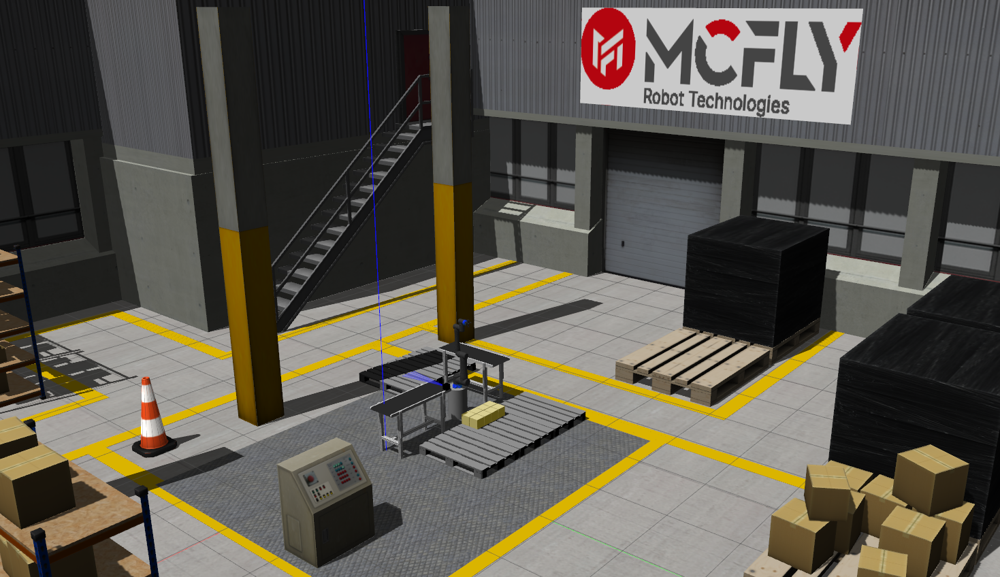
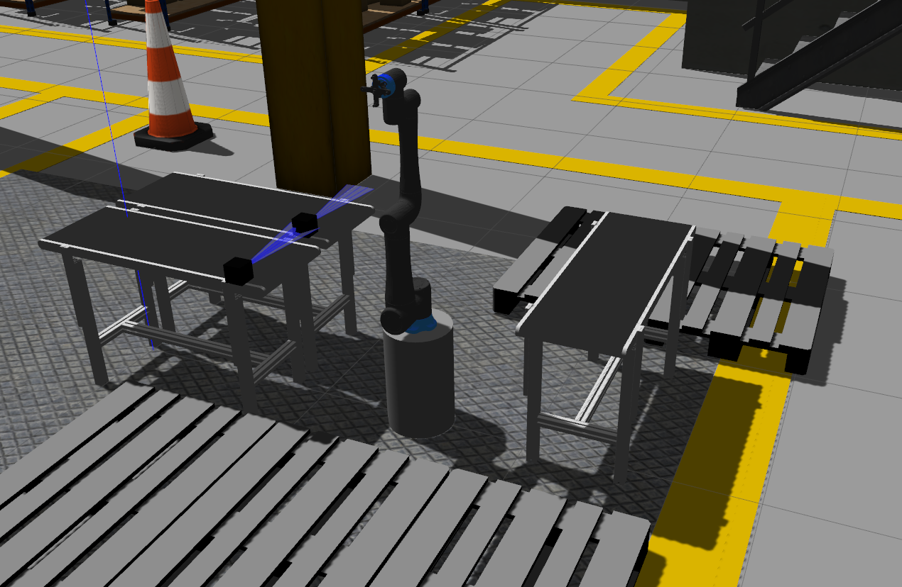
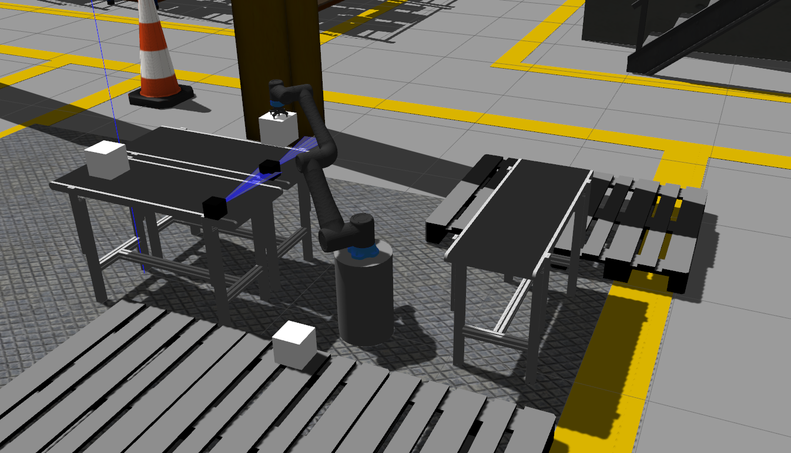

# Cobothon Robot Simulation

This repo has Orion 5 robot and control simulation in the gazebo factory environment. It was created for the Mcfly Cobothon competition.

*Author: Mehmet Kahraman / Date 18.10.2023*

Main Requirements:
--
- Ubuntu 20.04 Focal
- ROS 1 Noetic Desktop Full

Required ROS Packages:
--
```
sudo apt install ros-noetic-gazebo-ros*
sudo apt install ros-noetic-gazebo-dev
sudo apt install ros-noetic-gazebo-plugin
sudo apt install ros-noetic-gazebo-msgs

sudo apt install ros-noetic-robot-controllers*
sudo apt install ros-noetic-robot-state*
sudo apt install ros-noetic-joint*
sudo apt install ros-noetic-control*
sudo apt install ros-noetic-trajectory*
sudo apt install ros-noetic-transmission*
```

Competition Manual:
--
Competition manual can be found in this workspace which is called **competition_manual.pdf**

Running Simulation:
--

To display the robot on Rviz:
```
roslaunch robot_description display_robot.launch
```

----

To launch gazebo factory environments for chapters:
```
roslaunch factory_simulation sim_chapter1.launch
roslaunch factory_simulation sim_chapter2.launch
```

To spawn the robot:
```
roslaunch factory_simulation spawn_robot.launch
```

----

Spawn Box Models Node in Gazebo:
```
rosrun factory_simulation box_spawner.py
```

Simulation Images:
--
**Factory Image:**



**Chapter 1:**


**Chapter 2:**


