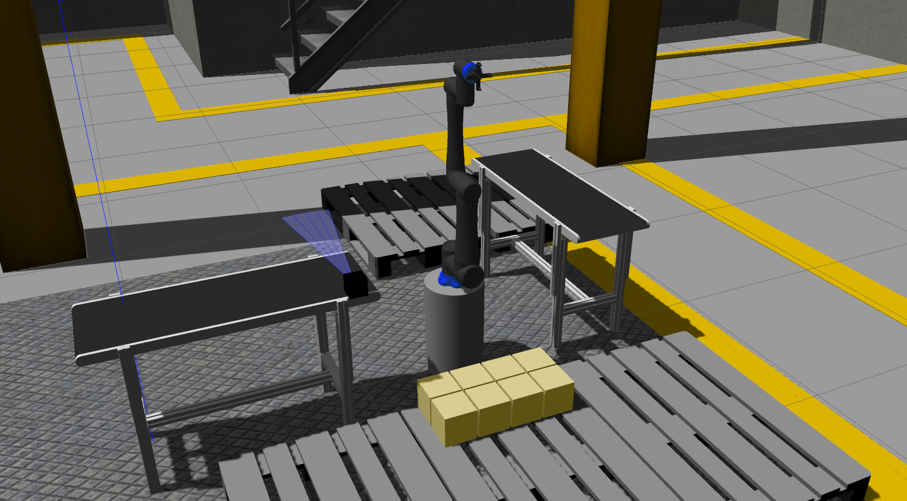

# COBOT TERBİYECİLERİ - Cenk Çetin, Abdullah Türkmen, Uğur Özgür Yıldız
# Cobothon Challenge Entry
--------------------------------------------------------------------------
# Factory Simulation Readme

This document provides instructions for running the factory simulation code. Make sure you have the necessary dependencies installed before proceeding.

## Instructions for Chapter 1

1. Launch the factory simulation environment by executing the following command:

    ```
    roslaunch factory_simulation orion_sim_ch1.launch
    ```

2. Make sure to adjust the box mesh in the `ch1_add_box_collision.py` script according to your requirements.

3. If you encounter any permission issues, ensure that all scripts in the `factory_simulation` directory have the executable permission set. You can do this by running the following command:

    ```
    chmod +x <path_to_script>
    ```

4. Execute the chapter 1 mission script using the command:

    ```
    rosrun factory_simulation chapter1_mission.py
    ```

5. To control the movement of the conveyor belt, set the power in the range of 0.0 to 100.0. Use the following command to adjust the power:

    ```
    rosservice call /belt1/conveyor/control "power: 0.0"
    ```

Make sure to follow the instructions carefully to ensure the proper functioning of the factory simulation.

## Additional Notes

- For any issues or troubleshooting, refer to the official documentation or contact the support team.
- Remember to save your work and configurations properly before making any changes.


-------------------------------------------------------------------------------------------------------------------------------------

This repo has Orion 5 robot and control simulation in the gazebo factory environment. It was created for the Mcfly Cobothon competition.

Date 22.10.2023

Main Requirements:
--
- Ubuntu 20.04 Focal
- ROS 1 Noetic Desktop Full

Required ROS Packages:
--
```
sudo apt install ros-noetic-gazebo-ros*
sudo apt install ros-noetic-gazebo-dev
sudo apt install ros-noetic-gazebo-plugin
sudo apt install ros-noetic-gazebo-msgs

sudo apt install ros-noetic-robot-controllers*
sudo apt install ros-noetic-robot-state*
sudo apt install ros-noetic-joint*
sudo apt install ros-noetic-control*
sudo apt install ros-noetic-trajectory*
sudo apt install ros-noetic-transmission*
```

Required .yaml format:


Running Simulation:
--

To display the robot on Rviz:
```
roslaunch robot_description display_robot.launch
```

----

To launch gazebo factory environments for chapters:
```
roslaunch factory_simulation sim_chapter1.launch
roslaunch factory_simulation sim_chapter2.launch
```

To spawn the robot:
```
roslaunch factory_simulation spawn_robot.launch
```

----

Spawn Box Models Node in Gazebo:
```
rosrun factory_simulation box_spawner.py
```

Simulation Images:
--
**Factory Image:**


**Chapter 1:**



**Chapter 2:**


